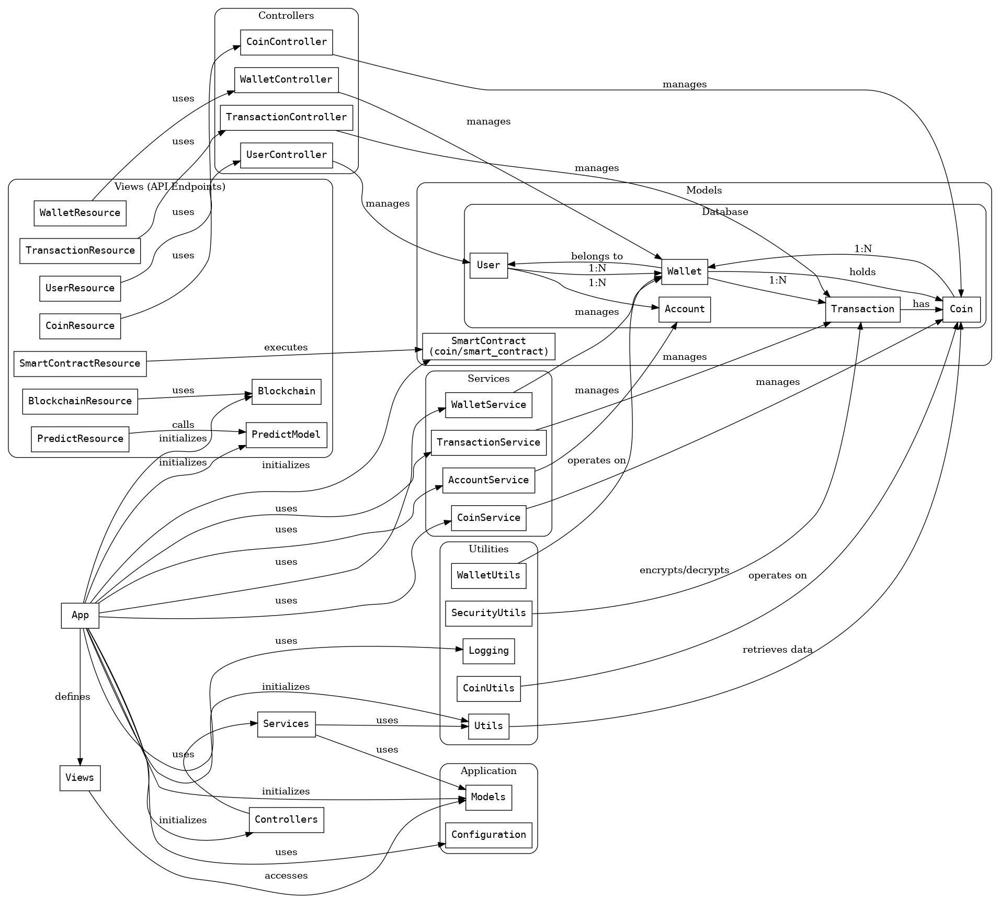

# PiNexus Autonomous Banking Network

## Architecture Diagram

 

This updated diagram includes the new components:

- Password Hashing Service (D): responsible for hashing passwords using the bcrypt algorithm.
- Input Validation Service (G): responsible for validating user input using the validator library.
- CI/CD Pipeline (I): responsible for automating testing, deployment, and monitoring of the application.
- Test Suite (J): responsible for running unit tests, integration tests, and end-to-end tests to ensure the application's stability and reliability.

These new components enhance the security, reliability, and maintainability of the PiNexus Autonomous Banking Network.

# Technical Guides

## Password Hashing
The PiNexus Autonomous Banking Network uses bcrypt for password hashing. The password-hash.js file contains the implementation of the password hashing algorithm.

## Input Validation
The PiNexus Autonomous Banking Network uses the validator library for input validation. The input-validator.js file contains the implementation of the input validation logic.

## CI/CD Pipelines
The PiNexus Autonomous Banking Network uses GitHub Actions for CI/CD pipelines. The .github/workflows/ci-cd.yml file contains the implementation of the CI/CD pipeline.

## API Documentation

### Authentication API

#### POST /auth/login
- Request Body: username and password
- Response: access_token and refresh_token

#### POST /auth/register
- Request Body: username, email, and password
- Response: access_token and refresh_token

### Banking API

#### GET /accounts
- Response: List of accounts

#### POST /transactions
- Request Body: from_account, to_account, and amount
- Response: Transaction ID

These code files and documentation provide a solid foundation for the PiNexus Autonomous Banking Network, incorporating advanced security features, robust input validation, and comprehensive testing and documentation.
